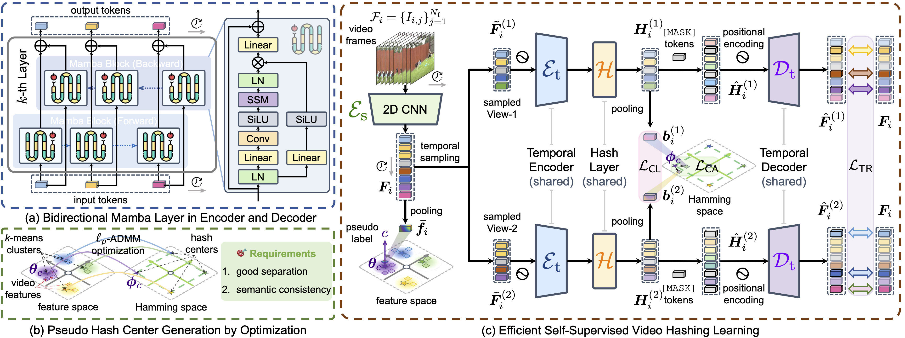

# Efficient Self-Supervised Video Hashing with Selective State Spaces

[toc]

## 1. Introduction

This repository contains the **PyTorch** implementation of our work at **AAAI 2025**:

> [**Efficient Self-Supervised Video Hashing with Selective State Spaces**](http://arxiv.org/abs/2412.14518). Jinpeng Wang, Niu Lian, Jun Li, Yuting Wang, Yan Feng, Bin Chen, Yongbing Zhang, Shu-Tao Xia.



We are happy to announce **S5VH**, the *first* Mamba-based video hashing model with an improved self-supervised learning paradigm. S5VH includes *bidirectional Mamba layers* for both the encoder and decoder, which are effective and efficient in capturing temporal relationships thanks to the data-dependent selective scanning mechanism with linear complexity. 
On hash learning strategy, we transform global semantics in the feature space into *semantically consistent* and **discriminative* hash centers, followed by a *center alignment loss* as a global learning signal. 
Experiments show S5VH’s efficacy and efficiency under various setups. 
Our study suggests the strong potential of state-space models in video hashing, which we hope can inspire further research.

In the following, we will guide you how to use this repository step by step. 🤗

## 2. Preparation

```bash
git clone https://github.com/gimpong/AAAI25-S5VH.git
cd AAAI25-S5VH/
```

### 2.1 Requirements

- python==3.11.8
- numpy==1.26.4
- pytorch==2.0.1
- torchvision==0.15.2
- mamba-ssm==2.0.4
- scipy==1.5.4
- h5py==3.1.0
- addict==2.4.0

### 2.2 Download the video feature datasets and organize them properly

Before running the code, make sure that everything is ready. The working directory is expected to be organized as below:


<details><summary>AAAI25-S5VH/</summary>
    <li>checkpoint/</li>
    <ul>
      <li>activitynet/</li>
      <ul>
          <li>S5VH_16bit</li>
          <li>S5VH_32bit</li>
          <li>S5VH_64bit</li>
      </ul>fcv/</li>
      <ul>
          <li>S5VH_16bit</li>
          <li>S5VH_32bit</li>
          <li>S5VH_64bit</li>
      </ul>hmdb/</li>
      <ul>
          <li>S5VH_16bit</li>
          <li>S5VH_32bit</li>
          <li>S5VH_64bit</li>
      </ul>ucf/</li>
      <ul>
          <li>S5VH_16bit</li>
          <li>S5VH_32bit</li>
          <li>S5VH_64bit</li>
      </ul>
    </ul>
    <li>data/</li>
    <ul>
      <li>activitynet/</li>
    	<ul>
        <li>train_feats.h5</li>
    		<li>final_train_train_assit.h5</li>
    		<li>final_train_latent_feats.h5</li>
    		<li>final_train_anchors.h5</li>
    		<li>final_train_sim_matrix.h5</li>
        <li>semantic.h5</li>
        <li>hash_center_16.h5</li>
        <li>hash_center_32.h5</li>
        <li>hash_center_64.h5</li>
        <li>test_feats.h5</li>
        <li>re_label.mat</li>
        <li>query_feats.h5</li>
        <li>q_label.mat</li>
    	</ul>
    	<li>fcv/</li>
    	<ul>
        <li>fcv_train_feats.h5</li>
        <li>final_train_train_assit.h5</li>
    		<li>final_train_latent_feats.h5</li>
    		<li>final_train_anchors.h5</li>
    		<li>final_train_sim_matrix.h5</li>
    		<li>semantic.h5</li>
        <li>hash_center_16.h5</li>
        <li>hash_center_32.h5</li>
        <li>hash_center_64.h5</li>
        <li>fcv_test_feats.h5</li>
        <li>fcv_test_labels.mat</li>
    	</ul>
    	<li>hmdb/</li>
    	<ul>
        <li>hmdb_train_feats.h5</li>
        <li>final_train_train_assit.h5</li>
    		<li>final_train_latent_feats.h5</li>
    		<li>final_train_anchors.h5</li>
    		<li>final_train_sim_matrix.h5</li>
    		<li>semantic.h5</li>
        <li>hash_center_16.h5</li>
        <li>hash_center_32.h5</li>
        <li>hash_center_64.h5</li>
        <li>hmdb_train_labels.mat</li>
        <li>hmdb_test_feats.h5</li>
        <li>hmdb_test_labels.mat</li>
    	</ul>
      <li>ucf/</li>
    	<ul>
        <li>ucf_train_feats.h5</li>
        <li>final_train_train_assit.h5</li>
    		<li>final_train_latent_feats.h5</li>
    		<li>final_train_anchors.h5</li>
    		<li>final_train_sim_matrix.h5</li>
    		<li>semantic.h5</li>
        <li>hash_center_16.h5</li>
        <li>hash_center_32.h5</li>
        <li>hash_center_64.h5</li>
        <li>ucf_train_labels.mat</li>
        <li>ucf_test_feats.h5</li>
        <li>ucf_test_labels.mat</li>
    	</ul>
    </ul>
    <li>logs/</li>
    <ul>
      <li>activitynet/</li>
      <ul>
          <li>S5VH_16bit</li>
          <li>S5VH_32bit</li>
          <li>S5VH_64bit</li>
      </ul>
      <li>fcv/</li>
      <ul>
          <li>S5VH_16bit</li>
          <li>S5VH_32bit</li>
          <li>S5VH_64bit</li>
      </ul>
      <li>hmdb/</li>
      <ul>
          <li>S5VH_16bit</li>
          <li>S5VH_32bit</li>
          <li>S5VH_64bit</li>
      </ul>
      <li>ucf/</li>
      <ul>
          <li>S5VH_16bit</li>
          <li>S5VH_32bit</li>
          <li>S5VH_64bit</li>
      </ul>
    </ul>
    <li>configs/</li>
    <li>dataset/</li>
    <li>inference/</li>
    <li>Loss/</li>
    <li>model/</li>
    <li>optim/</li>
    <li>utils/</li>
    <li>preprocess.py</li>
    <li>train.py</li>
    <li>eval.py</li>
    <li>requirements.txt</li>
</ul>
</details>


You may downloaded video features from the following Baidu Cloud links and put them into dataset-specific folder under the `data/` folder.

| *Dataset*   | *Video Features*                                                | *Hash Centers*                                       | *Logs and Checkpoints*                                        |
| ----------- | ------------------------------------------------------------ | ------------------------------------------------------------ | ------------------------------------------------------------ |
| FCVID       | [Baidu disk](https://pan.baidu.com/s/1v0qo4PtiZgFB9iLmj3sJIg?pwd=0000) | [Baidu disk](https://pan.baidu.com/s/1YCcjctYlSIaM8hmpspAn-A?pwd=0000) | [Baidu disk](https://pan.baidu.com/s/1zBeKzy0_WKQc0Zp4UZEf4w?pwd=0000) |
| ActivityNet | [Baidu disk](https://pan.baidu.com/s/1cDJ0-6T2-AOeLgp5rBihfA?pwd=0000) | [Baidu disk](https://pan.baidu.com/s/1sMh7-PC_30hxIwkS5jkPwQ?pwd=0000) | [Baidu disk](https://pan.baidu.com/s/188ZwHapMCSjxZh6oism71w?pwd=0000) |
| UCF101      | [Baidu disk](https://pan.baidu.com/s/1c2NMC0Y8R3zn4ionzKUP4g?pwd=0000) | [Baidu disk](https://pan.baidu.com/s/1fW7Oy3qJHd5Lg2gWt2QHaQ?pwd=0000) | [Baidu disk](https://pan.baidu.com/s/1vUndCb41kctv30bTLAEYdg?pwd=0000) |
| HMDB51      | [Baidu disk](https://pan.baidu.com/s/1su2STM7b2mg-jBfsN5iRIQ?pwd=0000) | [Baidu disk](https://pan.baidu.com/s/1Cqd4JEfmfVD45aU5mezvxQ?pwd=0000) | [Baidu disk](https://pan.baidu.com/s/1VP8fdLHOhkYbf7brREEvSQ?pwd=0000) |


### 2.3 Pre-processing: hash center generation

Before model training, please make sure the hash centers have been generated. 
You may download our preprocessed version of the hash center files from the Baidu Cloud links (see the table above) and put them to the video feature folders of specific datasets. 
Otherwise, you can generate these files by re-executing the pre-processing code. 
For example, on ActivityNet:

```
python preprocess.py --gpu 0 --config configs/S5VH/act.py
```

To modify the configurations for different datasets, you can replace `act.py` with `fcv.py`, `ucf.py` or `hmdb.py`.

### 2.4 Train

The training command is as follows:

```
python train.py --config configs/<MODEL_NAME>/<DATASET_NAME>.py --gpu <GPU_ID>
```

**Options**: 
- `<MODEL_NAME>`: `S5VH`, `LSTM`, `RetNet`, `RWKV`
- `<DATASET_NAME>`: `act`, `fcv`, `ucf`, `hmdb`
- `<GPU_ID>`: specify the gpu id

The logs, model checkpoints will be generated under the `logs/` and `checkpoint/` folders, respectively. 

### 2.5 Test

We provide the evaluation code for model checkpoints (if exist). 
The test command is as follows:

```
python eval.py --configs/<MODEL_NAME>/<DATASET_NAME>.py --gpu <GPU_ID>
```


## 3. Results

<style type="text/css">
</style>
<table><thead>
  <tr>
    <th colspan="2" rowspan="2">Dataset</th>
    <th rowspan="2">Code Length</th>
    <th rowspan="2">MAP@5</th>
    <th rowspan="2">MAP@20</th>
    <th rowspan="2">MAP@40</th>
    <th rowspan="2">MAP@80</th>
    <th rowspan="2">MAP@100</th>
    <th rowspan="2">Log</th>
    <th rowspan="2">MAP File</th>
  </tr>
  <tr>
  </tr></thead>
<tbody>
  <tr>
    <td colspan="2" rowspan="3">ActivityNet</td>
    <td>16</td>
    <td>0.180</td>
    <td>0.097</td>
    <td>0.060</td>
    <td>0.034</td>
    <td>0.029</td>
    <td><a href="logs/activitynet/S5VH_16bit/log.txt">ActivityNet-16bit.log</a></td>
    <td><a href="logs/activitynet/S5VH_16bit/map.txt">ActivityNet-16bit.map</a></td>
  </tr>
  <tr>
    <td>32</td>
    <td>0.250</td>
    <td>0.146</td>
    <td>0.087</td>
    <td>0.049</td>
    <td>0.040</td>
    <td><a href="logs/activitynet/S5VH_32bit/log.txt">ActivityNet-32bit.log</a></td>
    <td><a href="logs/activitynet/S5VH_32bit/map.txt">ActivityNet-32bit.map</a></td>
  </tr>
  <tr>
    <td>64</td>
    <td>0.266</td>
    <td>0.152</td>
    <td>0.095</td>
    <td>0.053</td>
    <td>0.043</td>
    <td><a href="logs/activitynet/S5VH_64bit/log.txt">ActivityNet-64bit.log</a></td>
    <td><a href="logs/activitynet/S5VH_64bit/map.txt">ActivityNet-64bit.map</a></td>
  </tr>
  <tr>
    <td colspan="2" rowspan="3">FCVID</td>
    <td>16</td>
    <td>0.346</td>
    <td>0.246</td>
    <td>0.214</td>
    <td>0.184</td>
    <td>0.173</td>
    <td><a href="logs/fcvid/S5VH_16bit/log.txt">FCVID-16bit.log</a></td>
    <td><a href="logs/fcvid/S5VH_16bit/map.txt">FCVID-16bit.map</a></td>
  </tr>
  <tr>
    <td>32</td>
    <td>0.482</td>
    <td>0.329</td>
    <td>0.285</td>
    <td>0.246</td>
    <td>0.231</td>
    <td><a href="logs/fcvid/S5VH_32bit/log.txt">FCVID-32bit.log</a></td>
    <td><a href="logs/fcvid/S5VH_32bit/map.txt">FCVID-32bit.map</a></td>
  </tr>
  <tr>
    <td>64</td>
    <td>0.520</td>
    <td>0.369</td>
    <td>0.325</td>
    <td>0.284</td>
    <td>0.269</td>
    <td><a href="logs/fcvid/S5VH_64bit/log.txt">FCVID-64bit.log</a></td>
    <td><a href="logs/fcvid/S5VH_64bit/map.txt">FCVID-64bit.map</a></td>
  </tr>
  <tr>
    <td colspan="2" rowspan="3">UCF101</td>
    <td>16</td>
    <td>0.471</td>
    <td>0.420</td>
    <td>0.375</td>
    <td>0.308</td>
    <td>0.269</td>
    <td><a href="logs/ucf/S5VH_16bit/log.txt">UCF101-16bit.log</a></td>
    <td><a href="logs/ucf/S5VH_16bit/map.txt">UCF101-16bit.map</a></td>
  </tr>
  <tr>
    <td>32</td>
    <td>0.534</td>
    <td>0.457</td>
    <td>0.406</td>
    <td>0.330</td>
    <td>0.291</td>
    <td><a href="logs/ucf/S5VH_32bit/log.txt">UCF101-32bit.log</a></td>
    <td><a href="logs/ucf/S5VH_32bit/map.txt">UCF101-32bit.map</a></td>
  </tr>
  <tr>
    <td>64</td>
    <td>0.578</td>
    <td>0.507</td>
    <td>0.458</td>
    <td>0.380</td>
    <td>0.338</td>
    <td><a href="logs/ucf/S5VH_64bit/log.txt">UCF101-64bit.log</a></td>
    <td><a href="logs/ucf/S5VH_64bit/map.txt">UCF101-64bit.map</a></td>
  </tr>
  <tr>
    <td colspan="2" rowspan="3">HMDB51</td>
    <td>16</td>
    <td>0.190</td>
    <td>0.128</td>
    <td>0.095</td>
    <td>0.065</td>
    <td>0.057</td>
    <td><a href="logs/hmdb/S5VH_16bit/log.txt">HMDB51-16bit.log</a></td>
    <td><a href="logs/hmdb/S5VH_16bit/map.txt">HMDB51-16bit.map</a></td>
  </tr>
  <tr>
    <td>32</td>
    <td>0.244</td>
    <td>0.175</td>
    <td>0.139</td>
    <td>0.092</td>
    <td>0.078</td>
    <td><a href="logs/hmdb/S5VH_32bit/log.txt">HMDB51-32bit.log</a></td>
    <td><a href="logs/hmdb/S5VH_32bit/map.txt">HMDB51-32bit.map</a></td>
  </tr>
  <tr>
    <td>64</td>
    <td>0.256</td>
    <td>0.189</td>
    <td>0.150</td>
    <td>0.103</td>
    <td>0.088</td>
    <td><a href="logs/hmdb/S5VH_64bit/log.txt">HMDB51-64bit.log</a></td>
    <td><a href="logs/hmdb/S5VH_64bit/map.txt">HMDB51-64bit.map</a></td>
  </tr>
</tbody></table>


## 4. References
If you find our code useful or use the toolkit in your work, please consider citing:
```
@inproceedings{Wang25_S5VH,
  author={Wang, Jinpeng and Lian, Niu and Li, Jun and Wang, Yuting and Feng, Yan and Chen, Bin and Zhang, Yongbing and Xia, Shu-Tao},
  title={Efficient Self-Supervised Video Hashing with Selective State Spaces},
  booktitle={Proceedings of the AAAI Conference on Artificial Intelligence},
  year={2025}
}
```

## 5. Acknowledgements
This code is based on our previous work [ConMH](https://github.com/huangmozhi9527/ConMH) at AAAI'23. 
We are also grateful for other teams for open-sourcing codes that inspire our work, including 
[SSVH](https://github.com/lixiangpengcs/Self-Supervised-Video-Hashing), 
[BTH](https://github.com/Lily1994/BTH), 
[MCMSH](https://github.com/haoyanbin918/MCMSH), 
[BerVAE](https://github.com/wangyucheng1234/BerVAE), 
[DKPH](https://github.com/IMCCretrieval/DKPH), 
and [SHC-IR](https://github.com/Wangld5/SHC-IR).

## 6. Contact
If you have any question, you can raise an issue or email Jinpeng Wang (wjp20@mails.tsinghua.edu.cn). We will reply you soon.
